# 🛍️ Flutter Shoe-commerce Project

## Overview

This Flutter e-commerce project is a simple CRUD application designed to demonstrate the core functionalities of a shopping app without using global state management solutions. The app allows users to browse, add, delete, update products.

## Key Features

- **Product Listing:** Browse a list of products with details including name, price, and image.
- **Product Details:** View detailed information about a specific product.
- **Update:** Add selected products to the shopping cart.
- **Delete:** View and manage items in the cart, including updating quantities or removing items.
- **Search and Filter:** Complete the checkout process with a simple order confirmation.

## Screenshots

### Splash

### Login Page

### Sign Up Page
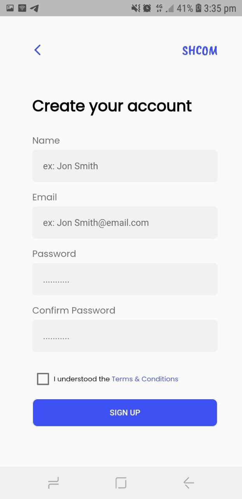

### Log Out
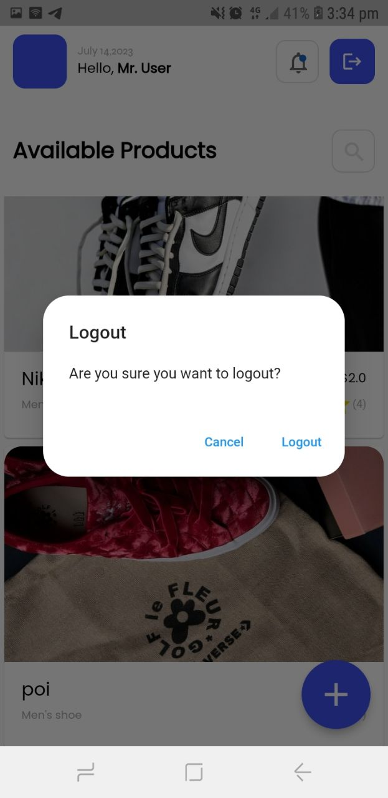

### Home Page
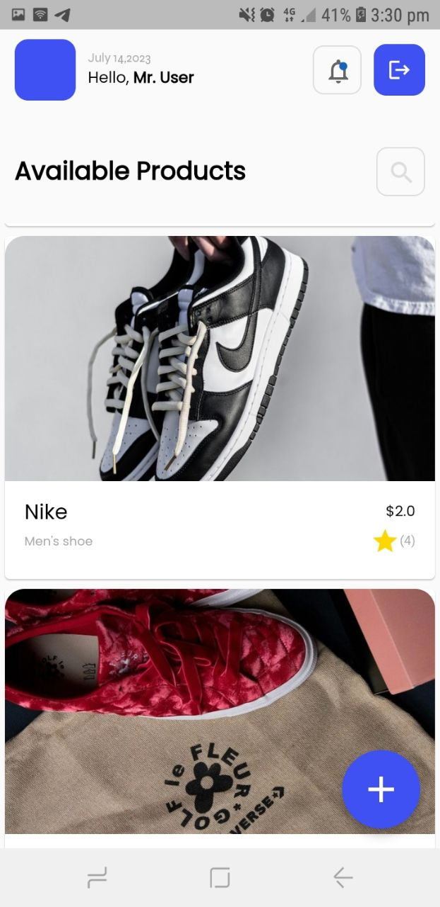

### Details page
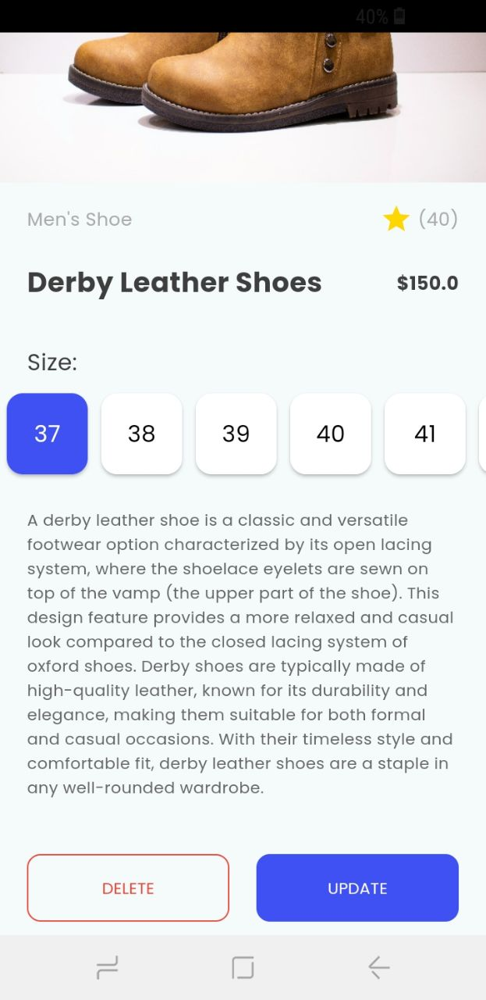
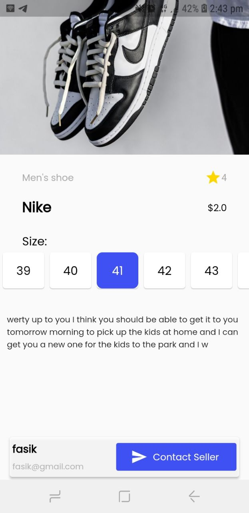

### Add Product
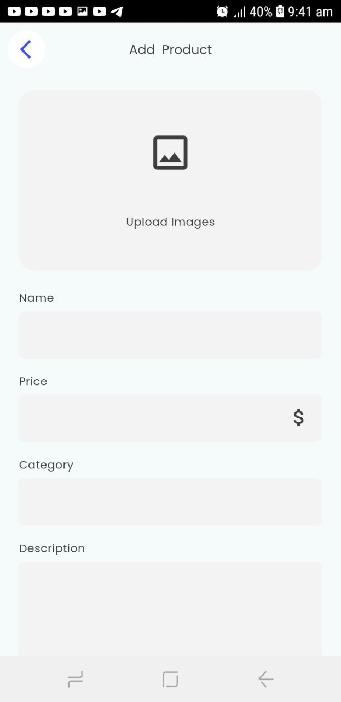
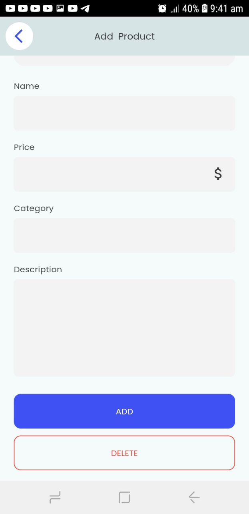

### Search Page
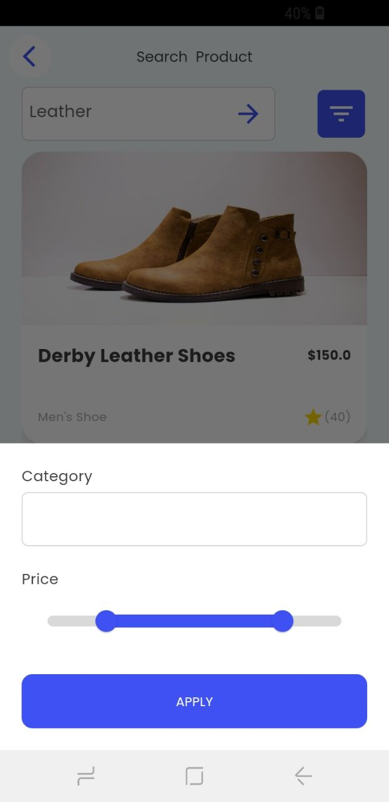

### Update Page
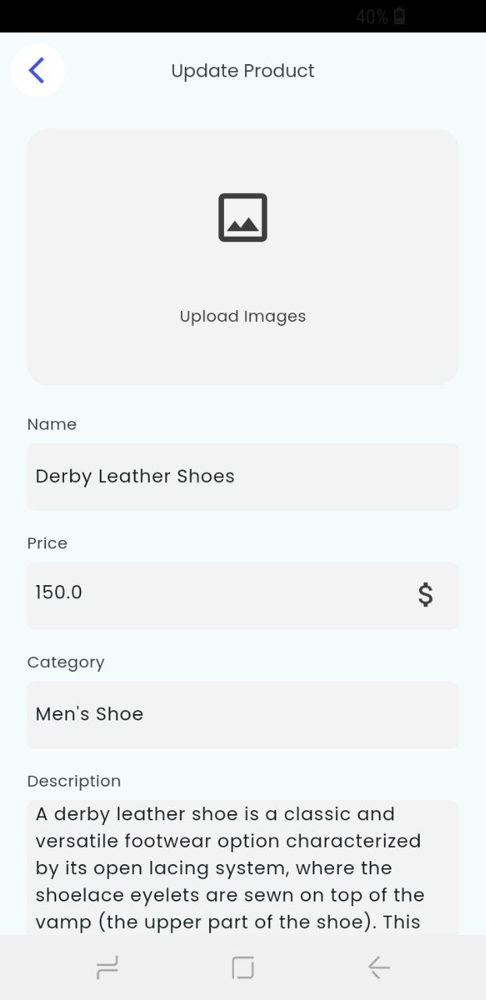
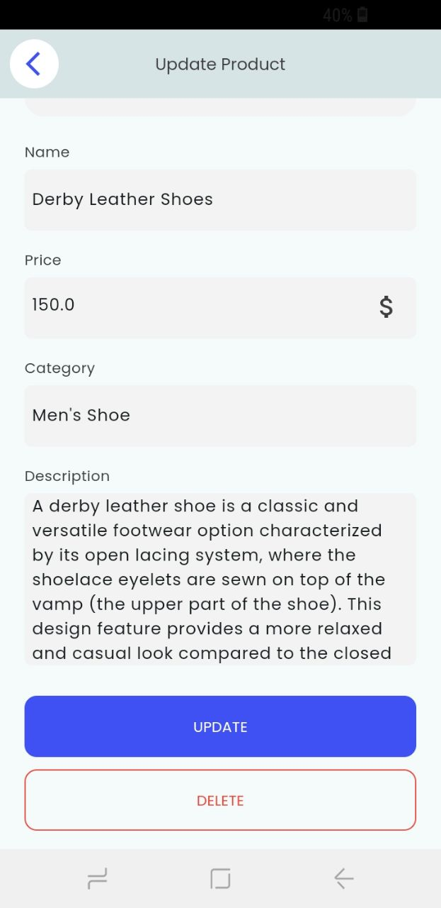

### All chats page
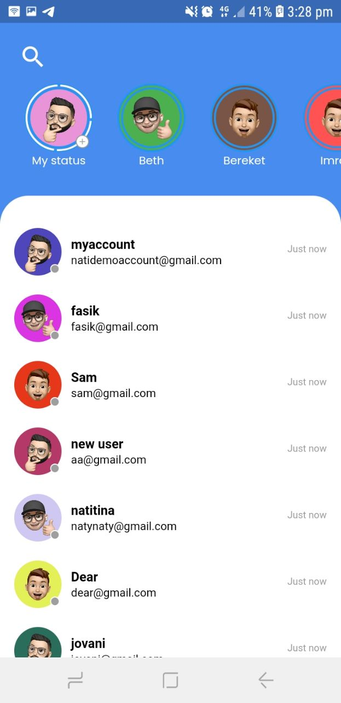

## Figma Design

You can view the Figma design for the project [here](https://www.figma.com/design/957Md2CrZ2B9KGjHy8RDcH/Internship?node-id=0-1&t=9RaUb8ueDD0uGHh6-0).
## Contact

For any questions or feedback, please reach out to me via [imran.mohammed@a2sv.org](mailto:imran.mohammed@a2sv.org).
